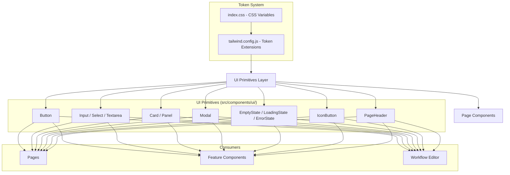
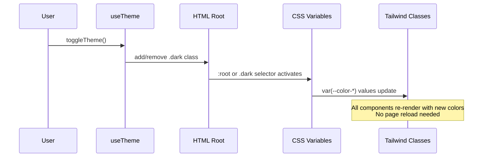

# Design Document: Frontend UI Consistency

## Overview

This design defines the technical approach for auditing and fixing visual inconsistencies across the Daflow frontend application. The core strategy is to introduce a centralized design token system (CSS custom properties + Tailwind config extensions), build a small set of reusable UI primitives, and systematically migrate all hardcoded values to token references.

The existing codebase uses inline Tailwind classes with hardcoded hex/rgba values (e.g., `bg-[#0071E3]`, `text-[#1d1d1f]/50`, `border-black/[0.08]`). The current `tailwind.config.js` only defines a minimal `primary` color palette and font families. There are no CSS custom properties for theming, no shared Button/Input/Card components, and no typography scale.

**Key Design Decisions:**

1. **CSS Variables as the source of truth** — All theme-aware values live in `:root` / `.dark` selectors in `index.css`. Tailwind references these via `var(--token-name)`.
2. **Tailwind config as the developer API** — Developers use semantic class names (`bg-surface`, `text-primary`, `shadow-md`) rather than raw CSS variables.
3. **Incremental migration** — Components are migrated file-by-file. No big-bang rewrite. Each page/component swap hardcoded values for token references.
4. **No new dependencies** — No component library added. Reusable primitives are built in-house using the existing Tailwind + React pattern.

## Architecture



**Theme Flow:**



## Components and Interfaces

### File Structure

```
frontend/src/
├── index.css                          # CSS variables (:root + .dark)
├── components/
│   └── ui/                            # NEW — shared UI primitives
│       ├── Button.tsx                  # All button variants
│       ├── IconButton.tsx              # Icon-only button with tap target
│       ├── Input.tsx                   # Text input
│       ├── Select.tsx                  # Select dropdown
│       ├── Textarea.tsx               # Textarea
│       ├── Card.tsx                    # Card container
│       ├── Modal.tsx                   # Modal with focus trap
│       ├── PageHeader.tsx             # Page title + action layout
│       ├── EmptyState.tsx             # Empty state pattern
│       ├── LoadingState.tsx           # Loading spinner/skeleton
│       ├── ErrorState.tsx             # Error with retry
│       └── index.ts                   # Barrel export
├── tailwind.config.js                 # Extended with full token system
└── ...existing structure unchanged
```

### Component Interfaces

#### Button

```typescript
interface ButtonProps extends React.ButtonHTMLAttributes<HTMLButtonElement> {
  variant?: 'primary' | 'secondary' | 'ghost' | 'danger' | 'outline'
  size?: 'sm' | 'md' | 'lg'
  loading?: boolean
  icon?: React.ReactNode
  iconPosition?: 'left' | 'right'
}
```

**Variant Mapping:**
| Variant | Background | Text | Border |
|---------|-----------|------|--------|
| primary | `bg-primary` | white | none |
| secondary | `bg-black/[0.05] dark:bg-white/[0.07]` | `text-primary/70` | none |
| ghost | transparent | `text-primary/60` | none |
| danger | `bg-danger` | white | none |
| outline | transparent | `text-primary/70` | `border border-default` |

**Size Mapping:**
| Size | Height | Padding-X | Use Case |
|------|--------|-----------|----------|
| sm | 28px (h-7) | 8px (px-2) | Icon buttons, toolbar |
| md | 32px (h-8) | 12px (px-3) | Default buttons |
| lg | 36px (h-9) | 16px (px-4) | Full-width CTA |

#### Input / Select / Textarea

```typescript
interface InputProps extends React.InputHTMLAttributes<HTMLInputElement> {
  label?: string
  error?: string
  required?: boolean
}

interface SelectProps extends React.SelectHTMLAttributes<HTMLSelectElement> {
  label?: string
  error?: string
  required?: boolean
  options: { value: string; label: string }[]
}

interface TextareaProps extends React.TextareaHTMLAttributes<HTMLTextAreaElement> {
  label?: string
  error?: string
  required?: boolean
}
```

#### Card

```typescript
interface CardProps {
  children: React.ReactNode
  className?: string
  padding?: 'none' | 'sm' | 'md' | 'lg'  // default: 'md' (16px)
}
```

#### Modal

```typescript
interface ModalProps {
  open: boolean
  onClose: () => void
  title: string
  children: React.ReactNode
  footer?: React.ReactNode
  maxWidth?: string  // default: '480px'
}
```

#### PageHeader

```typescript
interface PageHeaderProps {
  title: string
  subtitle?: string
  backTo?: string  // path for back navigation
  actions?: React.ReactNode
}
```

#### Feedback States

```typescript
interface EmptyStateProps {
  icon: React.ReactNode
  title: string
  description: string
  action?: React.ReactNode
}

interface LoadingStateProps {
  message?: string
}

interface ErrorStateProps {
  title?: string
  message: string
  onRetry: () => void
}
```

## Data Models

### Design Token Schema

The token system is not a runtime data model but a build-time configuration. The "data" here is the token definitions themselves.

#### CSS Variables (index.css)

```css
:root {
  /* Colors — Semantic */
  --color-primary: #0071E3;
  --color-primary-hover: #0077ED;
  --color-secondary: rgba(0, 0, 0, 0.05);
  --color-danger: #FF453A;
  --color-success: #30D158;
  --color-warning: #FF9F0A;
  --color-info: #5E5CE6;

  /* Backgrounds */
  --color-bg-page: #F5F5F7;
  --color-bg-surface: #FFFFFF;
  --color-bg-elevated: rgba(255, 255, 255, 0.95);

  /* Text */
  --color-text-primary: #1d1d1f;
  --color-text-secondary: rgba(29, 29, 31, 0.60);
  --color-text-muted: rgba(29, 29, 31, 0.35);

  /* Borders */
  --color-border-default: rgba(0, 0, 0, 0.08);
  --color-border-subtle: rgba(0, 0, 0, 0.05);

  /* Shadows */
  --shadow-sm: 0 1px 2px rgba(0, 0, 0, 0.06);
  --shadow-md: 0 2px 8px rgba(0, 0, 0, 0.08);
  --shadow-lg: 0 4px 16px rgba(0, 0, 0, 0.10);
  --shadow-xl: 0 8px 32px rgba(0, 0, 0, 0.12);
}

.dark {
  --color-primary: #4f8ef7;
  --color-primary-hover: #6ba3ff;
  --color-secondary: rgba(255, 255, 255, 0.07);
  --color-danger: #FF453A;
  --color-success: #30D158;
  --color-warning: #FF9F0A;
  --color-info: #5E5CE6;

  --color-bg-page: #111113;
  --color-bg-surface: #1C1C1E;
  --color-bg-elevated: rgba(28, 28, 30, 0.95);

  --color-text-primary: #FFFFFF;
  --color-text-secondary: rgba(255, 255, 255, 0.60);
  --color-text-muted: rgba(255, 255, 255, 0.35);

  --color-border-default: rgba(255, 255, 255, 0.08);
  --color-border-subtle: rgba(255, 255, 255, 0.05);

  --shadow-sm: 0 1px 2px rgba(0, 0, 0, 0.20);
  --shadow-md: 0 2px 8px rgba(0, 0, 0, 0.30);
  --shadow-lg: 0 4px 16px rgba(0, 0, 0, 0.40);
  --shadow-xl: 0 8px 32px rgba(0, 0, 0, 0.50);
}
```

#### Tailwind Config Extensions

```javascript
// tailwind.config.js
export default {
  content: ['./index.html', './src/**/*.{js,ts,jsx,tsx}'],
  darkMode: 'class',
  theme: {
    extend: {
      colors: {
        primary: {
          DEFAULT: 'var(--color-primary)',
          hover: 'var(--color-primary-hover)',
        },
        danger: 'var(--color-danger)',
        success: 'var(--color-success)',
        warning: 'var(--color-warning)',
        info: 'var(--color-info)',
        surface: 'var(--color-bg-surface)',
        elevated: 'var(--color-bg-elevated)',
        'page-bg': 'var(--color-bg-page)',
        'text-primary': 'var(--color-text-primary)',
        'text-secondary': 'var(--color-text-secondary)',
        'text-muted': 'var(--color-text-muted)',
        border: {
          DEFAULT: 'var(--color-border-default)',
          subtle: 'var(--color-border-subtle)',
        },
      },
      spacing: {
        'xs': '4px',
        'sm': '8px',
        'md': '12px',
        'lg': '16px',
        'xl': '24px',
        '2xl': '32px',
        '3xl': '48px',
      },
      borderRadius: {
        'sm': '6px',
        'md': '8px',
        'lg': '12px',
        'xl': '16px',
        '2xl': '20px',
        'full': '9999px',
      },
      boxShadow: {
        'sm': 'var(--shadow-sm)',
        'md': 'var(--shadow-md)',
        'lg': 'var(--shadow-lg)',
        'xl': 'var(--shadow-xl)',
      },
      fontSize: {
        'xs': ['12px', { lineHeight: '16px' }],
        'sm': ['14px', { lineHeight: '20px' }],
        'base': ['16px', { lineHeight: '24px' }],
        'lg': ['18px', { lineHeight: '28px' }],
        'xl': ['20px', { lineHeight: '28px' }],
        '2xl': ['24px', { lineHeight: '32px' }],
        '3xl': ['30px', { lineHeight: '36px' }],
      },
      fontWeight: {
        normal: '400',
        medium: '500',
        semibold: '600',
        bold: '700',
      },
      fontFamily: {
        sans: ['Inter', 'system-ui', 'sans-serif'],
        mono: ['JetBrains Mono', 'Menlo', 'monospace'],
      },
    },
  },
  plugins: [],
}
```

#### Typography Scale (utility classes)

These are applied via Tailwind utility composition in components:

| Level | Font Size | Weight | Line Height | Tailwind Classes |
|-------|-----------|--------|-------------|-----------------|
| page-title | 20px | 700 | 28px | `text-xl font-bold leading-7` |
| section-title | 15px | 600 | 22px | `text-[15px] font-semibold leading-[22px]` |
| card-title | 13px | 600 | 18px | `text-[13px] font-semibold leading-[18px]` |
| body | 13px | 400 | 20px | `text-[13px] font-normal leading-5` |
| label | 12px | 500 | 16px | `text-xs font-medium leading-4` |
| caption | 11px | 400 | 16px | `text-[11px] font-normal leading-4` |
| small | 10px | 400 | 14px | `text-[10px] font-normal leading-[14px]` |

## Correctness Properties

*A property is a characteristic or behavior that should hold true across all valid executions of a system — essentially, a formal statement about what the system should do. Properties serve as the bridge between human-readable specifications and machine-verifiable correctness guarantees.*

### Property 1: Token Light/Dark Parity

*For any* semantic color token defined in the `:root` CSS selector, there must exist a corresponding definition with the same variable name in the `.dark` CSS selector, ensuring complete theme coverage.

**Validates: Requirements 1.2**

### Property 2: No Hardcoded Semantic Colors in Components

*For any* component file in `src/components/**`, `src/pages/**`, or `src/features/**`, if the file contains a hardcoded color literal (hex, rgb, or rgba) that matches a value defined in the semantic token system, then that occurrence represents a violation — the file should reference the token instead.

**Validates: Requirements 1.6, 3.1, 3.2, 3.3, 3.4, 3.5, 3.6, 3.7**

### Property 3: Button Interactive State Correctness

*For any* Button component instance with any valid variant (primary, secondary, ghost, danger, outline) and any interactive state (default, hover, active, disabled), the rendered element must apply the correct CSS properties for that state: hover increases background opacity by 10%, active applies scale(0.97), disabled applies opacity 0.45 with cursor not-allowed, and all transitions use 150ms duration.

**Validates: Requirements 2.5**

### Property 4: Typography Scale Compliance

*For any* text element rendered in a component file (excluding third-party embedded components), its font-size value must be one of the defined typography scale values (10px, 11px, 12px, 13px, 14px, 15px, 16px, 18px, 20px, 24px, 30px) and its font-weight must be one of (400, 500, 600, 700).

**Validates: Requirements 4.9**

### Property 5: Form Element Styling Consistency

*For any* input, select, or textarea element rendered by the application's form components, the element must have height 36px, border-radius 8px, 1px border using the border token, correct background (black/4% light or white/6% dark), horizontal padding 12px, and font-size 13px.

**Validates: Requirements 7.1, 7.2, 7.3**

### Property 6: Icon Size and Stroke Consistency

*For any* SVG icon rendered in the application (excluding third-party chart libraries), its dimensions must be one of the three standard tiers (14px, 16px, or 20px) and its stroke-width must be 1.8.

**Validates: Requirements 8.1, 8.2**

### Property 7: Feedback State Pattern Consistency

*For any* list page (workflows, datasets, dashboards, reports, members, projects) in loading state, the page must display a centered spinner of at least 20px diameter. In empty state, it must display a centered icon, title (15-16px medium weight), and description (12-13px at 40% opacity). In error state, it must display a warning icon in danger color, error title, description, and a retry button.

**Validates: Requirements 11.1, 11.3, 11.4, 11.5**

### Property 8: Focus Indicator Visibility

*For any* focusable interactive element (button, link, input, select, textarea) when focused via keyboard navigation, the element must display a visible 2px ring using the primary color at 40% opacity.

**Validates: Requirements 12.2**

### Property 9: Icon-Only Button Accessibility

*For any* button element that contains an icon but no visible text label, the element must have an `aria-label` attribute with a descriptive value of at least 2 words.

**Validates: Requirements 12.3**

### Property 10: Color Contrast Compliance

*For any* text color and background color pair defined in the token system, the computed contrast ratio must be at least 4.5:1 for body text and at least 3:1 for UI component boundaries (borders, focus indicators).

**Validates: Requirements 12.4, 12.5**

## Error Handling

### Token System Errors

| Scenario | Handling |
|----------|----------|
| CSS variable undefined | Tailwind generates empty value; caught during build via visual regression |
| Token value typo in config | TypeScript won't catch (JS config); caught by visual review and snapshot tests |
| Missing dark mode variable | Property 1 test catches this; fallback to light mode value via CSS inheritance |

### Component Errors

| Scenario | Handling |
|----------|----------|
| Invalid Button variant prop | TypeScript union type prevents at compile time |
| Modal opened without content | Render empty body section; no crash |
| ErrorState without onRetry | TypeScript requires the prop; button always renders |
| Form field error without message | Error border shown; empty error text area (no layout shift) |
| Loading timeout (>15s) | Component transitions to error state with retry option |

### Migration Errors

| Scenario | Handling |
|----------|----------|
| Hardcoded color missed during migration | Property 2 test catches remaining violations |
| Token doesn't exist for a color | Document as intentional exception or extend token system (Req 1.9) |
| Component uses wrong token | Visual regression testing catches; code review enforces |

## Testing Strategy

### Unit Tests (Example-Based)

- **Button component**: Render each variant × size combination, verify correct classes applied
- **Modal component**: Test focus trap behavior, Escape key closes, backdrop click closes
- **Form components**: Test error state rendering, disabled state, required indicator
- **PageHeader**: Test back button rendering when `backTo` prop provided
- **Feedback states**: Test EmptyState, LoadingState, ErrorState render correct structure
- **Theme toggle**: Test that toggling adds/removes `.dark` class without reload

### Property-Based Tests

Property-based testing is applicable to this feature for validating token system completeness and consistency rules across the codebase.

**Library:** [fast-check](https://github.com/dubzzz/fast-check) (TypeScript PBT library, already compatible with the Vite + TypeScript stack)

**Configuration:** Minimum 100 iterations per property test.

**Tag format:** `Feature: frontend-ui-consistency, Property {number}: {property_text}`

| Property | Test Approach |
|----------|--------------|
| P1: Token parity | Parse index.css, extract :root vars, verify each exists in .dark |
| P2: No hardcoded colors | Scan component files with regex, cross-reference against token values |
| P4: Typography compliance | Parse component files, extract font-size/weight values, verify against scale |
| P6: Icon consistency | Parse SVG elements in components, verify size and strokeWidth |
| P8: Focus indicator | Render focusable elements, simulate focus, verify ring classes |
| P9: Icon button a11y | Find icon-only buttons in component source, verify aria-label presence |
| P10: Contrast | Compute WCAG contrast ratio for all token color pairs |

Properties P3, P5, and P7 are better validated through example-based component tests since they require rendering React components with specific props and checking computed styles.

### Integration Tests

- Full page render tests for each list page verifying loading → loaded → empty state transitions
- Theme toggle integration: toggle theme, verify all visible elements update colors
- Responsive layout: viewport resize below 768px triggers mobile layout

### Visual Regression

- Storybook stories (or equivalent) for each UI primitive in all variants
- Screenshot comparison for key pages in light and dark mode
- Before/after comparison during migration to catch unintended changes

### Accessibility Testing

- axe-core automated scans on each page
- Manual keyboard navigation walkthrough
- Screen reader testing for modal focus trap and aria-live announcements
- Contrast ratio validation using the token system values directly
