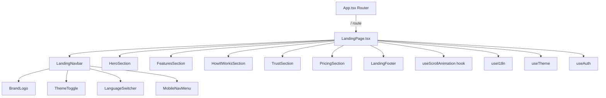

# Design Document: Landing Page

## Overview

The landing page is the public-facing marketing entry point for Daflow, rendered at `/` for unauthenticated visitors. It communicates the platform's value proposition, showcases features, builds trust, and drives sign-up conversions.

The page is built as a single-page React component (`LandingPage.tsx`) composed of modular sub-components in `src/components/landing/`. It integrates with the existing auth system, theme hook, and i18n provider. The design follows the Apple-inspired aesthetic already established in the application — clean typography, generous whitespace, backdrop-blur surfaces, and subtle scroll-triggered animations.

**Key design decisions:**
- Single route component with section-based sub-components (not separate routes per section)
- Intersection Observer for scroll animations (no heavy animation library dependency)
- Reuse existing `useTheme`, `useI18n`, `useAuth` hooks — no new state management
- SEO via `react-helmet-async` for declarative `<head>` management
- All landing page i18n strings added to the existing `src/i18n/index.tsx` translations object

## Architecture



**Routing strategy:**

The existing `App.tsx` already renders `<LandingPage />` at `/`. The current implementation shows the landing page to all visitors (authenticated or not). Per requirements, authenticated users navigating to `/` should be redirected to their dashboard. This is handled inside `LandingPage.tsx` with a conditional redirect:

```tsx
// Inside LandingPage component
const { isAuthenticated } = useAuth()
const { activeWorkspaceId } = useWorkspace()

if (isAuthenticated) {
  return <Navigate to={activeWorkspaceId ? `/workspaces/${activeWorkspaceId}` : '/workflows'} replace />
}
```

This keeps the route definition in `App.tsx` unchanged and avoids breaking existing navigation patterns.

## Components and Interfaces

### File Structure

```
src/
├── pages/
│   └── LandingPage.tsx              # Main page component, orchestrates sections
├── components/
│   └── landing/
│       ├── LandingNavbar.tsx         # Fixed top nav with blur, links, toggles
│       ├── HeroSection.tsx           # Value prop, CTAs, product preview
│       ├── FeaturesSection.tsx       # 4-6 feature cards with icons
│       ├── HowItWorksSection.tsx     # 3-4 step flow with connectors
│       ├── TrustSection.tsx          # Stats, testimonials, partner logos
│       ├── PricingSection.tsx        # 3 tiers: Free, Pro, Enterprise
│       ├── LandingFooter.tsx         # Links, newsletter, social
│       ├── MobileNavMenu.tsx         # Slide-in overlay for mobile
│       ├── CountUpAnimation.tsx      # Animated number counter
│       └── SectionWrapper.tsx        # Intersection Observer animation wrapper
├── hooks/
│   └── useScrollAnimation.ts        # Custom hook wrapping IntersectionObserver
└── i18n/
    └── index.tsx                     # Extended with landing page keys
```

### Component Interfaces

```typescript
// LandingNavbar
interface LandingNavbarProps {
  onSectionClick: (sectionId: string) => void
}

// HeroSection
interface HeroSectionProps {
  onGetStarted: () => void
  onWatchDemo: () => void
}

// FeaturesSection
interface FeatureCard {
  icon: React.ReactNode
  title: string
  description: string  // 15-25 words
}

// HowItWorksSection
interface Step {
  number: number
  title: string
  description: string
  visual: React.ReactNode  // Icon or illustration
}

// TrustSection
interface Stat {
  value: number
  label: string
  suffix?: string  // e.g., "+", "K"
}

interface Testimonial {
  quote: string
  name: string
  role: string
  company: string
}

// PricingSection
interface PricingTier {
  id: 'free' | 'pro' | 'enterprise'
  name: string
  price: string          // e.g., "$0", "$29", "Custom"
  period?: string        // e.g., "/month"
  features: string[]     // min 4 items
  cta: string
  highlighted?: boolean  // true for Pro
}

// LandingFooter
interface FooterLinkGroup {
  title: string
  links: { label: string; href: string; external?: boolean }[]
}

// SectionWrapper (animation wrapper)
interface SectionWrapperProps {
  children: React.ReactNode
  id?: string
  className?: string
  animation?: 'fade-up' | 'fade-in' | 'stagger'
  staggerDelay?: number  // ms between children, 150-300
}

// useScrollAnimation hook
interface UseScrollAnimationOptions {
  threshold?: number      // 0-1, default 0.15
  rootMargin?: string     // default "0px 0px -50px 0px"
  triggerOnce?: boolean   // default true
}

interface UseScrollAnimationReturn {
  ref: React.RefObject<HTMLElement>
  isVisible: boolean
}
```

### useScrollAnimation Hook

```typescript
import { useEffect, useRef, useState } from 'react'

export function useScrollAnimation(options: UseScrollAnimationOptions = {}): UseScrollAnimationReturn {
  const { threshold = 0.15, rootMargin = '0px 0px -50px 0px', triggerOnce = true } = options
  const ref = useRef<HTMLElement>(null)
  const [isVisible, setIsVisible] = useState(false)

  useEffect(() => {
    const prefersReducedMotion = window.matchMedia('(prefers-reduced-motion: reduce)').matches
    if (prefersReducedMotion) {
      setIsVisible(true)
      return
    }

    const observer = new IntersectionObserver(
      ([entry]) => {
        if (entry.isIntersecting) {
          setIsVisible(true)
          if (triggerOnce && ref.current) observer.unobserve(ref.current)
        }
      },
      { threshold, rootMargin }
    )

    if (ref.current) observer.observe(ref.current)
    return () => observer.disconnect()
  }, [threshold, rootMargin, triggerOnce])

  return { ref, isVisible }
}
```

### SEO Component (using react-helmet-async)

```typescript
// Inside LandingPage.tsx
import { Helmet } from 'react-helmet-async'

function LandingPageSEO({ lang }: { lang: 'en' | 'tr' }) {
  const title = lang === 'tr'
    ? 'Daflow – Veri Analizi Otomasyon Platformu'
    : 'Daflow – Data Analysis Automation Platform'

  const description = lang === 'tr'
    ? 'Daflow ile CSV/Excel verilerinizi görsel workflow editörde analiz edin, dashboard ve raporlar oluşturun. Kodsuz veri hattı.'
    : 'Analyze CSV/Excel data with a visual workflow editor, create dashboards and reports. No-code data pipelines by Daflow.'

  return (
    <Helmet>
      <title>{title}</title>
      <meta name="description" content={description} />
      <meta property="og:title" content={title} />
      <meta property="og:description" content={description} />
      <meta property="og:image" content="/brand/daflow-mark-blue.png" />
      <meta property="og:url" content="https://daflow.app" />
      <meta name="twitter:card" content="summary_large_image" />
      <meta name="twitter:title" content={title} />
      <meta name="twitter:description" content={description} />
      <meta name="twitter:image" content="/brand/daflow-mark-blue.png" />
      <script type="application/ld+json">
        {JSON.stringify({
          "@context": "https://schema.org",
          "@type": "SoftwareApplication",
          "name": "Daflow",
          "applicationCategory": "BusinessApplication",
          "operatingSystem": "Web",
          "description": description,
          "publisher": { "@type": "Organization", "name": "Daflow" }
        })}
      </script>
    </Helmet>
  )
}
```

## Data Models

### Landing Page Translation Keys

Added to the existing `translations` object in `src/i18n/index.tsx`:

```typescript
// Landing page keys (added to both en and tr objects)
interface LandingTranslations {
  // Navbar
  landing_features: string
  landing_howItWorks: string
  landing_pricing: string
  landing_login: string
  landing_signUp: string

  // Hero
  landing_hero_headline: string
  landing_hero_subheadline: string
  landing_hero_cta_primary: string
  landing_hero_cta_secondary: string

  // Features
  landing_features_title: string
  landing_features_subtitle: string
  landing_feature_workflow_title: string
  landing_feature_workflow_desc: string
  landing_feature_ai_title: string
  landing_feature_ai_desc: string
  landing_feature_dashboard_title: string
  landing_feature_dashboard_desc: string
  landing_feature_collab_title: string
  landing_feature_collab_desc: string
  landing_feature_bigdata_title: string
  landing_feature_bigdata_desc: string

  // How It Works
  landing_howItWorks_title: string
  landing_step1_title: string
  landing_step1_desc: string
  landing_step2_title: string
  landing_step2_desc: string
  landing_step3_title: string
  landing_step3_desc: string

  // Trust
  landing_trust_title: string
  landing_stat_users: string
  landing_stat_workflows: string
  landing_stat_datasources: string

  // Pricing
  landing_pricing_title: string
  landing_pricing_subtitle: string
  landing_pricing_free: string
  landing_pricing_pro: string
  landing_pricing_enterprise: string
  landing_pricing_cta_free: string
  landing_pricing_cta_pro: string
  landing_pricing_cta_enterprise: string

  // Footer
  landing_footer_desc: string
  landing_footer_product: string
  landing_footer_company: string
  landing_footer_legal: string
  landing_footer_newsletter_placeholder: string
  landing_footer_newsletter_submit: string
  landing_footer_newsletter_success: string
  landing_footer_newsletter_error: string
  landing_footer_privacy: string
  landing_footer_terms: string
}
```

### Pricing Tier Data

```typescript
const PRICING_TIERS: PricingTier[] = [
  {
    id: 'free',
    name: t('landing_pricing_free'),
    price: '$0',
    period: '/month',
    features: [/* 4+ features from translations */],
    cta: t('landing_pricing_cta_free'),
  },
  {
    id: 'pro',
    name: t('landing_pricing_pro'),
    price: '$29',
    period: '/month',
    features: [/* 6+ features from translations */],
    cta: t('landing_pricing_cta_pro'),
    highlighted: true,
  },
  {
    id: 'enterprise',
    name: t('landing_pricing_enterprise'),
    price: t('landing_pricing_custom'),
    features: [/* 5+ features from translations */],
    cta: t('landing_pricing_cta_enterprise'),
  },
]
```

### Newsletter Form State

```typescript
interface NewsletterState {
  email: string
  status: 'idle' | 'submitting' | 'success' | 'error'
  errorMessage?: string
}
```

Email validation uses a simple regex pattern:
```typescript
const EMAIL_REGEX = /^[^\s@]+@[^\s@]+\.[^\s@]+$/
```

## Correctness Properties

*A property is a characteristic or behavior that should hold true across all valid executions of a system — essentially, a formal statement about what the system should do. Properties serve as the bridge between human-readable specifications and machine-verifiable correctness guarantees.*

### Property 1: Feature card structure completeness

*For any* feature card data containing a valid icon, title, and description (15–25 words), the rendered FeatureCard component SHALL display all three elements as visible DOM nodes.

**Validates: Requirements 3.7**

### Property 2: Pricing tier structure completeness

*For any* pricing tier data containing a name, price, feature list (≥4 items), and CTA label, the rendered PricingTier component SHALL display all required elements as visible DOM nodes.

**Validates: Requirements 6.2**

### Property 3: Pricing CTA navigation includes plan identifier

*For any* pricing tier, clicking its CTA button SHALL trigger navigation to `/auth` (or `/login`) with a query parameter `plan` equal to the tier's id.

**Validates: Requirements 6.4**

### Property 4: Newsletter email validation

*For any* email string, submitting the newsletter form SHALL display a success message if the email matches the valid email pattern, and SHALL display an error message if it does not.

**Validates: Requirements 7.5, 7.6**

### Property 5: Touch target minimum size

*For any* interactive element (button, link, input) rendered on the landing page at a mobile viewport (< 768px), the element's computed click area SHALL be at least 44×44 pixels.

**Validates: Requirements 8.6**

### Property 6: Translation completeness

*For any* landing page translation key, both the Turkish and English translation values SHALL be non-empty strings.

**Validates: Requirements 12.1**

### Property 7: Language switch updates all visible text

*For any* language selection (TR or EN), switching the language SHALL cause all text elements rendered by landing page components to display content from the selected language's translation set, without a full page reload.

**Validates: Requirements 12.4**

### Property 8: Section link scrolls to matching section

*For any* section navigation link in the navbar (Features, How It Works, Pricing), clicking the link SHALL scroll the page such that the element with the corresponding section `id` is within the viewport.

**Validates: Requirements 13.4**

## Error Handling

| Scenario | Handling |
|----------|----------|
| Auth state loading | Show landing page immediately (no auth required); redirect happens after auth resolves |
| Newsletter submission failure | Display inline error message below input; do not clear the email field |
| Invalid email format | Client-side validation before submission; show localized error message |
| Image load failure | Use CSS background-color fallback; brand logo uses inline SVG via BrandLogo component |
| Translation key missing | Fall back to English string (existing i18n behavior) |
| IntersectionObserver unsupported | Elements render immediately visible (graceful degradation) |
| prefers-reduced-motion enabled | All animations disabled; elements render in final state |
| JavaScript disabled | Semantic HTML ensures content is readable; CTAs are `<a>` tags where possible |

## Testing Strategy

### Unit Tests (Example-Based)

Focus on specific scenarios and edge cases:

- **Routing**: Unauthenticated user sees landing page at `/`; authenticated user redirects to dashboard
- **SEO**: Verify exactly 1 `<h1>`, correct meta tags, JSON-LD schema presence
- **Responsive**: Hamburger menu appears at < 768px; multi-column at ≥ 768px
- **Theme**: ThemeToggle switches dark/light class; respects system preference
- **Accessibility**: `prefers-reduced-motion` disables animations; ARIA labels on interactive elements
- **Content**: Feature section has 4-6 cards; pricing has exactly 3 tiers; trust has ≥ 3 stats

### Property-Based Tests

Using **fast-check** (already compatible with the Vite + Vitest setup):

Each property test runs a minimum of **100 iterations** with generated inputs.

| Property | Generator Strategy |
|----------|-------------------|
| Property 1: Feature card structure | Generate random icon strings, titles (1-5 words), descriptions (15-25 words) |
| Property 2: Pricing tier structure | Generate random tier names, prices, feature lists (4-8 items) |
| Property 3: Pricing CTA navigation | Generate from the fixed set of tier ids: free, pro, enterprise |
| Property 4: Newsletter email validation | Generate random strings, valid emails, and invalid emails (missing @, spaces, etc.) |
| Property 5: Touch target size | Enumerate all interactive elements at mobile viewport |
| Property 6: Translation completeness | Enumerate all landing page translation keys |
| Property 7: Language switch | Generate random sequences of language switches |
| Property 8: Section link scroll | Generate from the fixed set of section ids |

**Tag format**: `Feature: landing-page, Property {N}: {title}`

### Integration Tests

- Full page render with mocked auth states
- Navigation flow: CTA click → /auth route with correct params
- Newsletter form submission flow (mock API)
- Scroll behavior with section links

### Performance Testing

- Lighthouse CI for LCP ≤ 2.5s and CLS ≤ 0.1
- Bundle size check: landing page chunk should be ≤ 150KB gzipped
- Image optimization audit (WebP format, lazy loading attributes)

### Accessibility Testing

- axe-core automated scan for WCAG 2.1 AA compliance
- Keyboard navigation through all interactive elements
- Screen reader testing for semantic structure (manual)
