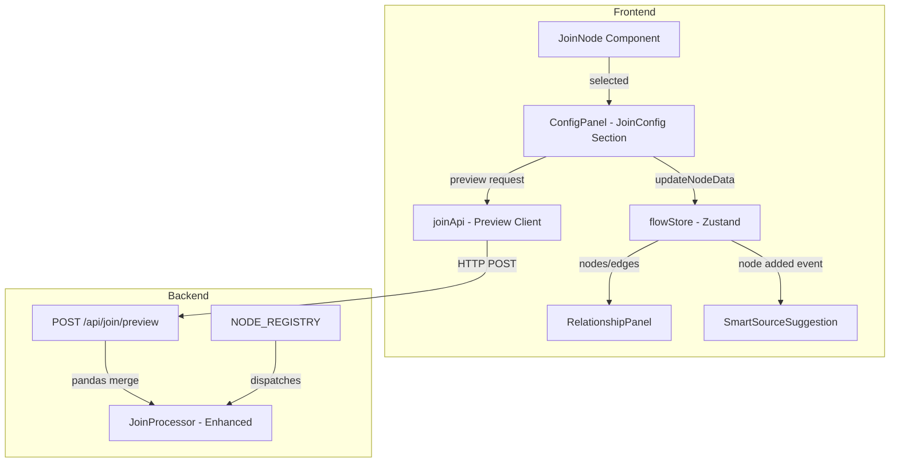

# Design Document: Multi-Table Join

## Overview

This feature enhances the existing JoinNode in the Daflow workflow editor with a rich configuration experience. The current JoinNode (`TransformationNodes.tsx`) exists as a component with left/right DataFrame handles and a hover-preview popup, but lacks a dedicated configuration UI in the ConfigPanel and is not yet registered in the `nodeTypes` map or backend `NODE_REGISTRY`.

The design introduces:
1. **Visual Join Type Selector** — Venn-diagram icons for INNER/LEFT/RIGHT/OUTER/CROSS
2. **Schema-Aware Column Key Selectors** — dropdowns populated from connected source schemas
3. **Auto-Suggest Engine** — identifies matching/similar columns across connected DataFrames
4. **Composite Key Support** — add/remove multiple key pairs
5. **Join Result Preview** — lightweight backend endpoint returning first 10 rows
6. **Smart Source Suggestion** — tooltip when a second data source is added
7. **Add Another Table Quick Action** — one-click chaining of join nodes
8. **Relationship Panel** — mini ER-diagram overlay
9. **Visual Connection Indicators** — edge badges showing join type on canvas

The implementation builds on the existing architecture: React Flow nodes, Zustand `flowStore`, ConfigPanel pattern, and FastAPI backend with pandas-based node processors.

## Architecture



### Key Design Decisions

1. **JoinNode registration**: Register `JoinNode` in `nodeTypes.ts` and `JoinProcessor` in `NODE_REGISTRY`. The component already exists but is unused.

2. **Dual-handle input model**: The JoinNode uses `left_df` and `right_df` target handles (not the generic `dataframe` handle). The `gather_inputs` function in the execution engine already supports handle-based routing via `targetHandle`.

3. **Schema propagation**: Column schemas are available on source nodes via `NodeData.columns` (type `ColumnMeta[]`). The ConfigPanel will traverse edges upstream to find connected source schemas.

4. **Preview endpoint separation**: A dedicated `/api/join/preview` endpoint avoids running the full workflow. It accepts sample data directly (JSON rows) rather than file IDs, keeping it stateless and fast.

5. **Auto-suggest as pure function**: The column matching logic is a pure function (`suggestJoinKeys`) that can be unit-tested and property-tested independently of React.

## Components and Interfaces

### New Files

| File | Purpose |
|------|---------|
| `frontend/src/components/panels/JoinConfigPanel.tsx` | Join-specific config UI (type selector, key selectors, preview) |
| `frontend/src/components/panels/JoinTypeSelector.tsx` | Visual join type selector with Venn icons |
| `frontend/src/components/panels/JoinKeyPairList.tsx` | Composite key pair list with add/remove |
| `frontend/src/components/panels/JoinPreviewTable.tsx` | Compact preview result table |
| `frontend/src/components/flow/RelationshipPanel.tsx` | Mini ER-diagram overlay |
| `frontend/src/components/flow/SmartSourceSuggestion.tsx` | Tooltip suggesting join connection |
| `frontend/src/components/flow/JoinEdgeBadge.tsx` | Edge badge showing join type icon |
| `frontend/src/utils/joinSuggestions.ts` | Pure function: auto-suggest matching columns |
| `frontend/src/api/join.ts` | API client for join preview endpoint |
| `backend/app/api/routes/join.py` | FastAPI route for join preview |

### Modified Files

| File | Change |
|------|--------|
| `frontend/src/components/nodes/TransformationNodes.tsx` | Update JoinNode to use dual handles (`left_df`, `right_df`) |
| `frontend/src/components/nodes/nodeTypes.ts` | Register `JoinNode` |
| `frontend/src/components/panels/ConfigPanel.tsx` | Add `join_node` case rendering `JoinConfigPanel` |
| `frontend/src/components/panels/NodePanel.tsx` | Add join_node to `NODE_DEFINITIONS` |
| `frontend/src/store/flowStore.ts` | Add `getUpstreamSchema(nodeId, handle)` selector |
| `backend/app/core/node_registry.py` | Register `JoinProcessor` |
| `backend/app/nodes/transformation/join.py` | Support list-based `left_on`/`right_on` for composite keys |
| `backend/app/api/router.py` | Include join routes |

### Component Interfaces

```typescript
// JoinConfigPanel props
interface JoinConfigPanelProps {
  nodeId: string
  config: JoinNodeConfig
  leftSchema: ColumnMeta[] | null
  rightSchema: ColumnMeta[] | null
  onConfigChange: (key: string, value: unknown) => void
}

// Join node config shape
interface JoinNodeConfig {
  how: 'inner' | 'left' | 'right' | 'outer' | 'cross'
  keyPairs: Array<{ left: string; right: string }>
  suffixes: [string, string]
  dismissedSuggestions: Array<{ left: string; right: string }>
}

// Auto-suggest function signature
interface JoinKeySuggestion {
  left: string
  right: string
  confidence: 'exact' | 'fuzzy'
  reason: string
}

function suggestJoinKeys(
  leftColumns: ColumnMeta[],
  rightColumns: ColumnMeta[],
  dismissed: Array<{ left: string; right: string }>
): JoinKeySuggestion[]

// Preview API request/response
interface JoinPreviewRequest {
  left_data: Record<string, unknown>[]   // max 1000 rows
  right_data: Record<string, unknown>[]  // max 1000 rows
  how: string
  left_on: string[]
  right_on: string[]
  suffixes: [string, string]
}

interface JoinPreviewResponse {
  rows: Record<string, unknown>[]  // max 10 rows
  columns: string[]
  total_rows: number
  message?: string
}

// Relationship panel data model
interface RelationshipEntity {
  nodeId: string
  label: string
  columns: ColumnMeta[]
}

interface RelationshipEdge {
  sourceNodeId: string
  targetNodeId: string
  joinNodeId: string
  joinType: string
  keyPairs: Array<{ left: string; right: string }>
}
```

### JoinNode Handle Update

The current JoinNode has a single `dataframe` target handle. It needs two distinct target handles:

```typescript
// Updated JoinNode handles
<Handle type="target" position={Position.Left} id="left_df" style={{ top: '35%' }} />
<Handle type="target" position={Position.Left} id="right_df" style={{ top: '65%' }} />
<Handle type="source" position={Position.Right} id="dataframe" />
```

The execution engine's `gather_inputs` already routes by `targetHandle`, so upstream outputs will be correctly mapped to `left_df` and `right_df` keys.

### Schema Resolution Logic

```typescript
// Added to flowStore or as a utility hook
function useUpstreamSchema(nodeId: string, handleId: string): ColumnMeta[] | null {
  const { nodes, edges } = useFlowStore()
  
  // Find edge targeting this node on the specified handle
  const incomingEdge = edges.find(
    e => e.target === nodeId && e.targetHandle === handleId
  )
  if (!incomingEdge) return null
  
  // Get the source node
  const sourceNode = nodes.find(n => n.id === incomingEdge.source)
  if (!sourceNode) return null
  
  // Return columns from source node data
  return (sourceNode.data as NodeData).columns ?? null
}
```

## Data Models

### Frontend State (Zustand flowStore)

No new top-level store slices are needed. Join configuration lives in `node.data.config` following the existing pattern. The `JoinNodeConfig` interface defines the shape:

```typescript
// Stored in node.data.config
{
  how: 'inner',
  keyPairs: [
    { left: 'customer_id', right: 'id' }
  ],
  suffixes: ['_x', '_y'],
  dismissedSuggestions: []
}
```

### Backend Join Preview Endpoint

```python
# Pydantic models for /api/join/preview
class JoinPreviewRequest(BaseModel):
    left_data: List[Dict[str, Any]]    # max 1000 items
    right_data: List[Dict[str, Any]]   # max 1000 items
    how: Literal['inner', 'left', 'right', 'outer', 'cross']
    left_on: List[str]
    right_on: List[str]
    suffixes: Tuple[str, str] = ('_x', '_y')

class JoinPreviewResponse(BaseModel):
    rows: List[Dict[str, Any]]         # max 10 items
    columns: List[str]
    total_rows: int
    message: Optional[str] = None
```

### Enhanced JoinProcessor Config

The existing `JoinProcessor` accepts `on`, `left_on`, `right_on` as strings. It will be enhanced to also accept lists:

```python
# Enhanced config handling in JoinProcessor.execute()
left_on = config.get("left_on")   # str | List[str]
right_on = config.get("right_on") # str | List[str]

# Normalize to list for composite key support
if isinstance(left_on, str):
    left_on = [left_on]
if isinstance(right_on, str):
    right_on = [right_on]
```

### Relationship Panel Data Derivation

The RelationshipPanel derives its data from the flowStore graph:

```typescript
function deriveRelationships(nodes: Node[], edges: Edge[]): {
  entities: RelationshipEntity[]
  relationships: RelationshipEdge[]
} {
  // 1. Find all source nodes (file_upload, database_query)
  // 2. Find all join nodes
  // 3. For each join node, trace edges back to find connected sources
  // 4. Build entity list from sources, relationship list from joins
}
```

## Correctness Properties

*A property is a characteristic or behavior that should hold true across all valid executions of a system — essentially, a formal statement about what the system should do. Properties serve as the bridge between human-readable specifications and machine-verifiable correctness guarantees.*

### Property 1: Join type selection persists to config

*For any* valid join type from the set {inner, left, right, outer, cross}, selecting it in the JoinTypeSelector should result in the node's `config.how` field being set to exactly that value.

**Validates: Requirements 1.3**

### Property 2: Column dropdowns reflect connected schemas

*For any* two column schemas (left with N columns, right with M columns) attached to connected source nodes, the JoinConfigPanel dropdowns should contain exactly N options for the left selector and exactly M options for the right selector, with names matching the schema column names.

**Validates: Requirements 2.1**

### Property 3: Column key selection updates config

*For any* valid column name from either the left or right schema, selecting it in the corresponding dropdown should set `config.keyPairs[i].left` or `config.keyPairs[i].right` to exactly that column name.

**Validates: Requirements 2.3, 2.4**

### Property 4: Invalid join key detection

*For any* join key string that does not exist in the current connected DataFrame's column schema, the system should flag it as invalid and produce a warning indicator.

**Validates: Requirements 2.5**

### Property 5: Auto-suggest exact match identification

*For any* two sets of column names (left columns L and right columns R), the `suggestJoinKeys` function should return suggestions that include every column name present in both L and R (the intersection) with confidence "exact".

**Validates: Requirements 3.1**

### Property 6: Auto-suggest fuzzy match fallback

*For any* two sets of column names where no exact matches exist, the `suggestJoinKeys` function should return pairs where one column name is a case-insensitive substring of the other, with confidence "fuzzy".

**Validates: Requirements 3.2**

### Property 7: Composite key list integrity

*For any* sequence of add and remove operations on key pairs, the resulting `config.keyPairs` array should have length equal to (initial length + adds - removes), and each remaining pair should preserve its original left/right values.

**Validates: Requirements 4.2, 4.3**

### Property 8: Non-CROSS join requires at least one key pair

*For any* join type in {inner, left, right, outer} with zero configured key pairs, the validation function should return an error. For join type "cross" with zero key pairs, no error should be returned.

**Validates: Requirements 4.5**

### Property 9: Config change invalidates preview

*For any* change to `config.how` or `config.keyPairs`, the preview state should be reset to null (hidden), ensuring stale results are never displayed.

**Validates: Requirements 5.6**

### Property 10: Preview endpoint returns at most 10 rows

*For any* valid left DataFrame (up to 1000 rows), right DataFrame (up to 1000 rows), and valid join configuration, the preview endpoint should return a response with `rows` array of length at most 10.

**Validates: Requirements 10.1**

### Property 11: Invalid join keys return 422

*For any* join key string that does not exist as a column name in the provided left or right DataFrame sample, the preview endpoint should return HTTP 422 with a descriptive error message.

**Validates: Requirements 10.2**

### Property 12: Input truncation to 1000 rows

*For any* input DataFrame with more than 1000 rows, the preview endpoint should only process the first 1000 rows per side, ensuring response times remain bounded.

**Validates: Requirements 10.4**

## Error Handling

| Scenario | Handling |
|----------|----------|
| Source node disconnected mid-config | Show placeholder in dropdown, clear invalid key selections, disable preview button |
| Schema changes after key selection | Detect orphaned keys via schema comparison, show warning badge, offer to clear |
| Preview endpoint timeout (>2s) | Frontend shows timeout message, suggests reducing data or checking connection |
| Preview endpoint 422 (invalid keys) | Display backend error message in preview area with red styling |
| Preview endpoint 500 (server error) | Generic "Preview failed" message with retry button |
| Cross join with large data warning | Show estimated row count (left × right) before preview, warn if > 10,000 |
| Composite key type mismatch | Backend validates column dtypes are compatible before merge, returns 422 if not |
| Circular graph detection | Execution engine already handles via topological sort ValueError |
| Empty DataFrame on one side | Allow preview, show result (which may be empty for inner join) |
| Network error during preview | Show "Connection error" with retry action |

### Validation Rules

```typescript
function validateJoinConfig(config: JoinNodeConfig, leftSchema: ColumnMeta[] | null, rightSchema: ColumnMeta[] | null): ValidationError[] {
  const errors: ValidationError[] = []
  
  // Rule 1: Non-cross joins need at least one key pair
  if (config.how !== 'cross' && config.keyPairs.length === 0) {
    errors.push({ code: 'NO_KEYS', message: 'At least one join key pair is required' })
  }
  
  // Rule 2: All selected keys must exist in their respective schemas
  for (const pair of config.keyPairs) {
    if (leftSchema && !leftSchema.find(c => c.name === pair.left)) {
      errors.push({ code: 'INVALID_LEFT_KEY', message: `Column "${pair.left}" not found in left table` })
    }
    if (rightSchema && !rightSchema.find(c => c.name === pair.right)) {
      errors.push({ code: 'INVALID_RIGHT_KEY', message: `Column "${pair.right}" not found in right table` })
    }
  }
  
  // Rule 3: No duplicate key pairs
  const seen = new Set<string>()
  for (const pair of config.keyPairs) {
    const key = `${pair.left}::${pair.right}`
    if (seen.has(key)) {
      errors.push({ code: 'DUPLICATE_PAIR', message: `Duplicate key pair: ${pair.left} = ${pair.right}` })
    }
    seen.add(key)
  }
  
  return errors
}
```

## Testing Strategy

### Property-Based Tests (fast-check)

The project uses Vite + TypeScript. Property-based tests will use **fast-check** as the PBT library, integrated with Vitest.

Each property test runs a minimum of **100 iterations** and is tagged with its design property reference.

**Target functions for PBT:**
- `suggestJoinKeys()` — pure function, ideal for PBT (Properties 5, 6)
- `validateJoinConfig()` — pure validation function (Properties 4, 7, 8)
- Backend preview endpoint — via HTTP test client (Properties 10, 11, 12)
- Config state transitions — via store actions (Properties 1, 3, 9)

**Tag format:** `Feature: multi-table-join, Property {N}: {description}`

### Unit Tests (Vitest)

- JoinTypeSelector renders all 5 options (Req 1.1)
- Tooltip content for each join type (Req 1.2)
- Active state highlighting (Req 1.4)
- Partial connection placeholder (Req 2.2)
- Auto-suggest pre-selection when config is empty (Req 3.3)
- Dismissal persistence (Req 3.4)
- Add key pair button presence (Req 4.1)
- Key pair list rendering (Req 4.4)
- Preview button visibility conditions (Req 5.1)
- Loading indicator during preview (Req 5.3)
- Preview table rendering (Req 5.4)
- Error message display (Req 5.5)
- Smart source suggestion trigger conditions (Req 6.1–6.4)
- Add another table button and graph mutations (Req 7.1–7.3)
- Relationship panel entity rendering (Req 8.1–8.6)
- Edge badge rendering (Req 9.1–9.3)
- Empty result handling (Req 10.3)

### Integration Tests

- Full flow: connect two sources → configure join → preview → execute
- Backend preview endpoint with real pandas merge
- Schema propagation through connected nodes
- Relationship panel reactivity to graph changes

### Test File Structure

```
frontend/src/utils/__tests__/joinSuggestions.test.ts     — PBT for suggestJoinKeys
frontend/src/utils/__tests__/joinValidation.test.ts      — PBT for validateJoinConfig
frontend/src/components/panels/__tests__/JoinConfigPanel.test.tsx — Unit tests
frontend/src/components/flow/__tests__/RelationshipPanel.test.tsx — Unit tests
backend/tests/test_join_preview.py                        — PBT + unit for preview endpoint
```
